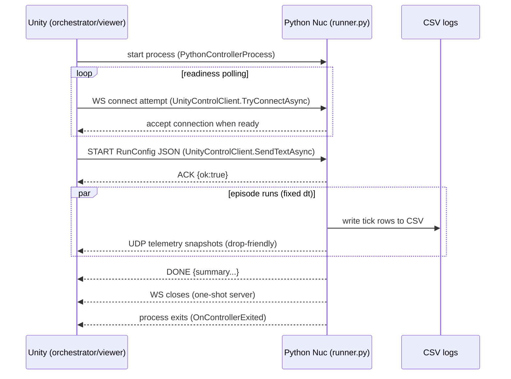
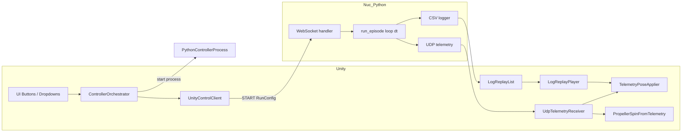

# Nuc — Deterministic Control & Simulation Core (Apis)

This document is the **technical reference** for the **Nuc** subsystem inside **Apis**.

- **Apis** defines the overall sim-to-real + learning workflow (high-level narrative in `README.md`).
- **Nuc** is the deterministic core: it runs controller simulations, produces logs, and provides playback in Unity.

> Unity is the viewer + orchestrator.
> Nuc is the clock + truth + dataset generator.

---

## 0. What we are building (the core)

A system for **running and visualizing simulations of controllers implemented in Python**, plus a **replay pipeline** for the resulting logs.

Key ideas:

- **Deterministic simulation** lives in Python.
- **Unity orchestrates and visualizes** (no physics authority).
- **Logs are the artifact**: replay is driven directly from log data.

---

## 1. Process architecture (Unity ↔ Nuc)

Nuc is a **separate Python process** that:

1) exposes a **WebSocket control endpoint** (Unity → Python), and
2) optionally streams **UDP telemetry** (Python → Unity) for best-effort visualization.



Key points:

- **Determinism lives in Python** (fixed `dt`, seeded RNG, single-authority loop).
- **Unity doesn’t drive time**; it samples state via UDP and triggers runs via WebSocket.
- The Python process is **one-shot** by design: run one episode, exit, restart for the next.

---

## 2. RunConfig contract (what Unity sends)

Python expects **one JSON message** with `type="START"`, then runs one episode and exits.

At minimum, the message must include: `run_id`, `seed`, `dt`, `duration_s`.
Other sections control dynamics randomization, reference program, logging, telemetry, etc.

RunConfigs are stored on disk under:

```
C:\Core\Apis\nuc\runconfigs\<controller_name>\*.json
```

The controller dropdown selects the controller folder; the runconfig dropdown shows JSONs under that folder.

---

## 3. Files and responsibilities

### 3.1 Python (Nuc)

- **runner.py**
  - WebSocket server + episode runner dispatcher.
  - Selects a controller implementation by name (e.g., `toy_controller`, `crazyflie_controller`, `simple_controller`).
  - Runs a deterministic episode, writes a CSV log, optionally emits UDP telemetry.

- **toy_controller/**
  - Toy deterministic quad model + cascaded control loop for dataset generation.

- **crazyflie_controller/**
  - PID/rate supervisor based controller implementation (Crazyflie-style).

- **simple_controller/**
  - Minimal controller implementation, same interface as the others.

### 3.2 Unity (Orchestrator + Viewer)

Core scripts:

- **PythonControllerProcess.cs** — start/stop the Python process (`runner.py`), capture stdout/stderr, raise an exit event.
- **UnityControlClient.cs** — WebSocket client for sending RunConfig and reading ACK/DONE.
- **ControllerOrchestrator.cs** — high-level glue: start controller, poll readiness, send RunConfig, track state.
- **ControllerRunConfigSwitcher.cs** — controller dropdown population; repopulates runconfigs per controller.
- **RunConfigDropdownPopulator.cs** — dropdown population from `nuc\runconfigs` and auto-selects first item.
- **UdpTelemetryReceiver.cs** — thread-based UDP receiver with “latest-only” semantics.
- **TelemetryPoseApplier.cs** — apply received pose to the drone GameObject.
- **PropellerSpinFromTelemetry.cs** — visual-only prop spin driven by telemetry.
- **ControllerStatusUI.cs / ControllerUIButtonState.cs** — status text and button interactivity.
- **SendToPythonOnAction.cs / SendJsonFileToPythonOnAction.cs** — direct-send helpers for quick tests.

Replay scripts:

- **LogReplayList.cs** — populates a scrollview with available logs under `nuc\logs`.
- **LogReplayListItem.cs** — UI list item (Toggle + filename label).
- **LogReplayPlayer.cs** — loads CSV and replays the transform of a target object.

---

## 4. Data layout on disk

Logs and runconfigs live **outside** the Unity project, next to `nuc\python`:

```
C:\Core\Apis\nuc\runconfigs\<controller_name>\*.json
C:\Core\Apis\nuc\logs\<controller_name>\*.csv
```

Log filenames include the controller name so the origin is unambiguous.

---

## 5. Runtime flows

### 5.1 Single run (manual)

1) Choose controller from dropdown.
2) Choose runconfig from dropdown.
3) Start Controller (spawns Python).
4) Start Simulation (sends RunConfig).
5) Python runs once, logs CSV, exits.

### 5.2 Batch run (run all configs)

1) Toggle **Run All Configs**.
2) Start Simulation.
3) Unity loops through each runconfig, restarting Python for each run.
4) Status shows `i/N` while running.

### 5.3 Replay

1) Refresh log list.
2) Select a log (single-select with highlight).
3) Press Replay.
4) `LogReplayPlayer` replays pose from the CSV.

While replaying, the status UI shows **Replay Mode**.

---

## 6. Python behavior (summary)

The Python process:

- listens on `ws://HOST:PORT` (default `127.0.0.1:7361`)
- accepts exactly one `START` message
- runs a deterministic episode with fixed dt
- writes a CSV log
- optionally streams UDP telemetry snapshots
- responds with `DONE` + summary and exits

---

## 7. Unity behavior (summary)

- Unity launches Python with `PythonControllerProcess`.
- It polls WebSocket readiness before sending a run.
- It switches runconfig lists based on controller selection.
- It supports batch runs and a clean **Stop** action to reset everything.
- It supports log replay using the same scene and drone object.

---

## 8. Notes and gotchas

- **One-shot server semantics** are intentional; batch mode restarts Python between runs.
- **UDP telemetry is best-effort**; Unity always shows the latest packet only.
- **Replay is log-driven** and independent of the controller runtime.

---

## Appendix — Quick reference diagram


