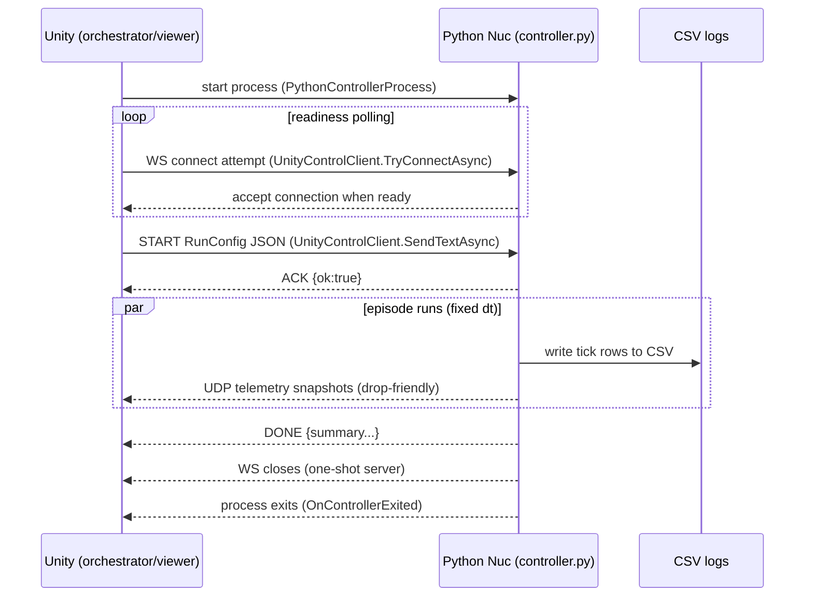
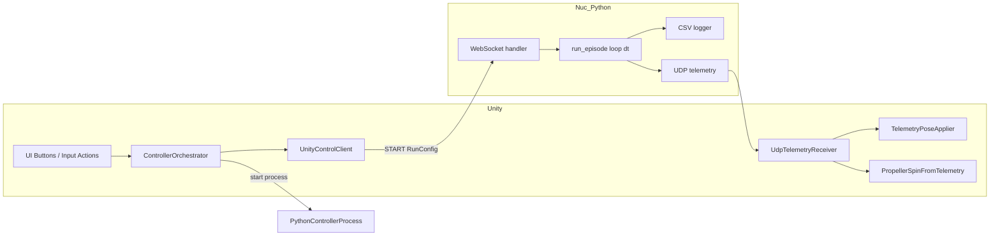

# Nuc — Deterministic Control & Simulation Core (Apis)

This document is the **deep technical documentation** for the **Nuc** subsystem inside **Apis**.

- **Apis** defines the *overall* sim-to-real + learning workflow (high-level narrative in the repo README).
- **Nuc** is the “authoritative nucleus”: deterministic simulation + engineered controller + logging, isolated from any rendering loop.

> Unity is a viewer + orchestrator.
> Nuc is the clock + truth + dataset generator.

## 0. Where this fits in Apis

The Apis README frames the overall roadmap (e.g., Nuc → Waggle → Propolis → Scopa → Proboscis).
Nuc specifically provides the deterministic substrate for controller + data generation (and later: learning from logs).

## 1. Process architecture (Unity ↔ Nuc)

Nuc is implemented as a **separate Python process** that:

1) exposes a **WebSocket control endpoint** (Unity → Nuc), and
2) optionally streams **UDP telemetry** (Nuc → Unity) for best-effort visualization.



Key points:

- **Determinism lives in Nuc** (fixed `dt`, seeded RNG, single-authority loop).
- **Unity doesn’t “drive” time**; it only *samples* state via UDP and triggers runs via WS.

## 2. The control surface: what Unity sends vs what the controller does

Nuc’s Python server expects a single JSON message with `type="START"`, then runs one episode and exits (one-shot behavior).

At minimum, the message must include: `run_id`, `seed`, `dt`, `duration_s`.
The rest of the RunConfig toggles dynamics randomization, reference program, logging, telemetry, etc.

Example RunConfig (StreamingAssets/RunConfig.json):

```json
{
  "type": "START",
  "run_id": "ep_0001",
  "seed": 42,
  "dt": 0.01,
  "duration_s": 10.0,
  "real_time": true,
  "dynamics": {
    "mass": 1.0,
    "drag_coeff": 0.08,
    "tau_roll": 0.08,
    "tau_pitch": 0.08,
    "tau_thrust": 0.05,
    "wind": {
      "type": "constant",
      "vec": [
        0.0,
        0.0,
        0.0
      ]
    }
  },
  "controller": {
    "kp_pos": 2.0,
    "kd_pos": 2.5,
    "kp_yaw": 3.0,
    "tilt_max_deg": 25.0,
    "yaw_rate_max_dps": 180.0,
    "thrust_min": 0.0,
    "thrust_max": 30.0
  },
  "init": {
    "pos": [
      0.0,
      0.0,
      1.0
    ],
    "vel": [
      0.0,
      0.0,
      0.0
    ],
    "rpy_deg": [
      0.0,
      0.0,
      0.0
    ]
  },
  "flight_plan": [
    {
      "type": "hover",
      "duration_s": 2.0,
      "pos": [
        0.0,
        0.0,
        1.0
      ],
      "yaw_mode": "hold"
    },
    {
      "type": "random_steps",
      "duration_s": 6.0,
      "bounds": {
        "x": [
          -1.0,
          1.0
        ],
        "y": [
          -1.0,
          1.0
        ],
        "z": [
          0.7,
          1.5
        ]
      },
      "hold_s": [
        0.5,
        1.5
      ],
      "yaw_step_prob": 0.2,
      "yaw_step_deg": [
        -45,
        45
      ]
    },
    {
      "type": "hover",
      "duration_s": 2.0,
      "pos": [
        0.0,
        0.0,
        1.0
      ],
      "yaw_mode": "hold"
    }
  ],
  "logging": {
    "out_dir": "logs"
  },
  "telemetry": {
    "enabled": true,
    "rate_hz": 60.0,
    "udp_host": "127.0.0.1",
    "udp_port": 15000,
    "payload": "pose_vel"
  }
}
```

## 3. Files + responsibilities

### Python

- **controller.py**  
  WebSocket server + episode runner for a **3D toy quad** with a **cascaded controller**, fixed-step simulation, CSV logging, and optional UDP telemetry.

### Unity (C#)

- **PythonControllerProcess.cs** — start/stop the Python process (controller.py), capture stdout/stderr, and raise an exit event.
- **UnityControlClient.cs** — WebSocket client for sending RunConfig and reading ACK/DONE messages.
- **ControllerOrchestrator.cs** — high-level glue: start controller, poll readiness, send RunConfig, track state.
- **UdpTelemetryReceiver.cs** — thread-based UDP receiver with “latest-only” semantics.
- **TelemetryPoseApplier.cs** — apply received pose to the Crazyflie GameObject (Unity transform update).
- **PropellerSpinFromTelemetry.cs** — rotate propeller transforms as a function of `thrust_norm`.
- **ControllerStatusUI.cs / ControllerUIButtonState.cs** — minimal UI state display + button interactivity gating.
- **SendToPythonOnAction.cs / SendJsonFileToPythonOnAction.cs** — direct-send helpers driven by Input System actions (still useful for quick tests).
- **LookAtTarget.cs** — camera convenience.
- **ControllerState.cs** — enum for orchestrator state machine.

# Part A — Python (controller.py): Implementation Reference

## A1. High-level contract

The python process:

- listens on `ws://HOST:PORT` (default `127.0.0.1:7361`)
- accepts exactly one `START` message
- runs a deterministic episode with fixed dt
- writes a CSV log
- optionally streams UDP telemetry snapshots
- responds with `DONE` + summary and exits

## A2. Core math helpers

- `clamp(x, lo, hi)`: command + safety clamping
- `deg2rad(d)`: user-friendly degrees → radians
- `wrap_pi(a)`: yaw error wrapping to avoid discontinuities
- `rpy_to_rotmat(roll, pitch, yaw)`: ZYX rotation; used for thrust direction
- `rotmat_to_quat(R)`: telemetry quaternion for Unity

## A3. State and IO dataclasses

- `QuadState`: position/velocity + roll/pitch/yaw
- `ControlOut`: roll/pitch/yaw_rate + thrust commands
- `RefOut`: reference position + yaw

## A4. Reference program (what “flies” the vehicle)

`ReferenceProgram` produces targets for the controller so we can generate diverse datasets *without* a human pilot.

Key methods:

- `__init__(flight_plan, rng)`: seeded randomness for reproducible “random” segments
- `reset()`: restart flight plan
- `step(t, dt, state)`: outputs `p_ref` and `yaw_ref` based on segment type

Supported segment patterns include: `hover`, `random_steps`, `circle`.
If the plan ends, it defaults to “hover at current position”.

## A5. Cascaded controller (engineered control, not learned)

`CascadedController` is a classic “outer-loop position → inner-loop attitude” structure:

- position/velocity PD → desired acceleration
- map desired acceleration → roll/pitch + thrust (with tilt limits)
- yaw P → yaw-rate command (with rate limit)

This is the sort of black box your colleague is trying to learn from closed-source drones — except here we control it and can generate perfectly labeled pairs.

## A6. Dynamics: toy, but drone-like

`ToyQuadDynamics` implements:

- gravity
- linear drag
- first-order tracking for roll/pitch (time constants)
- yaw integrated from yaw-rate command
- optional first-order thrust lag
- optional wind

This is not full rigid-body physics — it is “controller-shaped” dynamics that are stable, deterministic, and easy to learn from.

## A7. Episode runner: fixed-step + logging + telemetry

`run_episode(cfg)`:

- validates required keys
- seeds RNG
- creates reference program + controller + dynamics
- runs `N = ceil(duration_s/dt)` steps at fixed `dt`
- writes one CSV row per tick
- optionally sends UDP telemetry snapshots at `telemetry.rate_hz`
- optionally wall-clock throttles if `real_time=true`

## A8. WebSocket server (one-shot)

`handler(ws)`: receive RunConfig → ACK → run → DONE → stop loop (process exits).

# Part B — Unity: Script-by-script behavior

## B1. ControllerOrchestrator.cs

Role: Launch Python, poll WebSocket readiness, send RunConfig, track state.

Methods:

- `OnEnable/OnDisable`: subscribe Input System actions
- `Start/OnDestroy`: subscribe/unsubscribe process exit event
- `HandleControllerExited`: sets `State=Exited`
- `StartControllerAndWaitUntilReady`: starts process and polls WS
- `SendRunConfig`: loads JSON from `StreamingAssets/runConfigFileName` and sends it
- `UI_StartController/UI_StartSimulation`: button-friendly entry points

Why you saw two status strings:

- one comes from `ControllerStatusUI` (prints `State`)
- the other is `LastStatusMessage` (human string you *can* display)

## B2. PythonControllerProcess.cs

Role: Start/stop `controller.py` as an OS process and surface stdout/stderr in the Unity Console.

Key methods:

- `StartController()`: validates paths, starts process, begins async reads
- `StopController()`: best-effort stop via `Kill()`
- `OnProcessExited(...)`: raises `OnControllerExited`

## B3. UnityControlClient.cs

Role: WebSocket client.

Key methods:

- `TryConnectAsync()`: connect wrapper returning `bool`
- `ConnectAsync()/DisconnectAsync()`
- `SendTextAsync(message, readReply)`
- `ReceiveTextAsync()`: frame-join until end-of-message

## B4. UdpTelemetryReceiver.cs

Role: Background-thread UDP receiver with “latest-only” semantics (drop-friendly).

Key methods:

- `StartReceiver()/StopReceiver()`
- `ReceiveLoop()`
- `TryGetLatest(out pkt)`

## B5. TelemetryPoseApplier.cs

Role: Apply pose to a target transform from UDP telemetry.

Key methods:

- `Update()`: map sim → Unity coordinates; optional smoothing
- `ConvertSimToUnityRotation(qSim)`: basis conversion

## B6. PropellerSpinFromTelemetry.cs

Role: Visual-only propeller spin driven by `thrust_norm`.

Mapping snippet:

```csharp
float x = Mathf.Clamp01(thrustNorm);
x = Mathf.Pow(x, 0.5f); // boosts low values
float rpmTarget = Mathf.Lerp(minRpm, maxRpm, x);
```

## B7. ControllerStatusUI.cs

Role: Show orchestrator state with TMP text + color mapping.

## B8. ControllerUIButtonState.cs

Role: Enable/disable UI buttons based on orchestrator state.

## B9/B10. SendToPythonOnAction.cs + SendJsonFileToPythonOnAction.cs

Role: Direct-senders driven by Input System actions (still handy for quick tests).

## B11. LookAtTarget.cs

Role: Camera look-at helper.

# Part C — Notes, gotchas, and next decisions

## C1. One-shot server semantics

Current `controller.py` exits after one run — consistent with your preference to restart each time.

## C2. Real-time vs as-fast-as-possible

- `real_time=false`: dataset generation
- `real_time=true`: interactive viewing + stable pacing

## C3. Python performance

For one quad at small `dt`, Python + NumPy is fine.
If you later need massive batched rollouts, port to JAX (GPU) and keep the same run-config contract.

## C4. UDP “latest-only” is intentional

Unity never accumulates backpressure; it always shows the freshest state.

## Appendix — Quick reference diagrams


