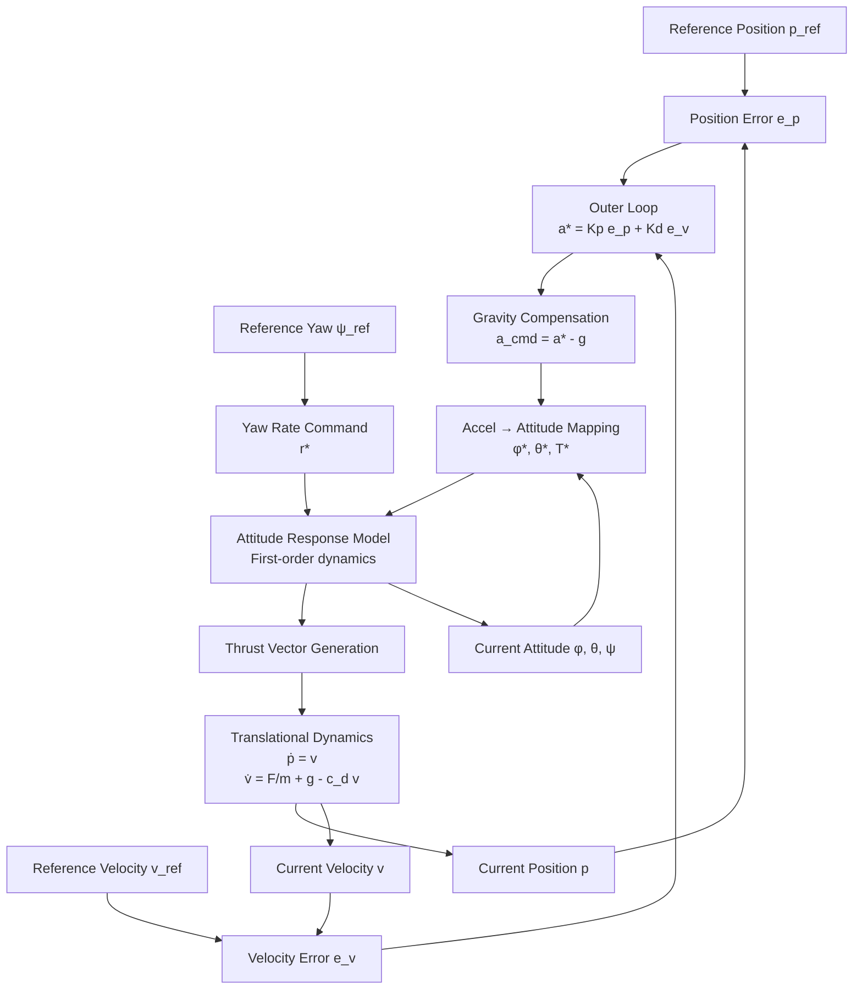

# Nuc - Deterministic Control & Simulation Core for Apis

## 1. Context: Apis and Nuc

**Apis** is a broader research and experimentation framework for autonomous systems, learning-based control, and simulation-to-real workflows.

**Nuc** is a foundational subsystem within Apis.

Nuc acts as a **deterministic, authoritative control-and-simulation nucleus**, isolated from rendering engines, UI frameworks, and real-time visualization concerns. Visualization tools (such as Unity) are treated as *viewers and orchestrators*, not as sources of truth.

---

## 2. Why Nuc Exists

Many autonomy experiments fail due to architectural issues rather than algorithmic ones:

- simulation time tied to render frame rate
- non-deterministic update loops
- logging coupled to visualization
- control logic embedded in engines not designed for it

Nuc exists to explicitly **separate concerns**:

| Concern | Owner |
|------|------|
| Simulation time | Nuc |
| Control logic | Nuc |
| Reference generation | Nuc |
| Logging & datasets | Nuc |
| Visualization | External (Unity, etc.) |
| User interaction | External |

---

## 3. Design Philosophy

### 3.1 Determinism over convenience

- Fixed time step (`dt`)
- Explicit random seeds
- Reproducible runs by construction

### 3.2 Controllers are functions, not engines

Controllers are treated as explicit functions:

```
control = f(state, reference, config)
```

No hidden coupling to render loops or engine callbacks.

### 3.3 Simulation ≠ visualization

Simulation can run:

- slower than real time
- faster than real time
- headless

Visualization samples state snapshots opportunistically.

### 3.4 Logs are first-class artifacts

Logs are the primary output of Nuc. Visualization exists to debug and interpret datasets.

---

## 4. What Nuc Is (and Is Not)

### Nuc is

- a deterministic simulation runner
- a controller execution environment
- a dataset generator
- a reference-signal executor
- a ground-truth authority

### Nuc is not

- a real-time flight controller
- a physics engine replacement
- a game loop
- a UI framework
- a Unity plugin

---

## 5. Core Responsibilities

### 5.1 Simulation Loop

Nuc owns a fixed-step simulation loop:

```
while running:
    reference = reference_program(t)
    control   = controller(state, reference)
    state     = dynamics.step(state, control, dt)
    log(state, control, reference)
    t += dt
```

### 5.2 Controller Execution

Nuc runs a known, hand-designed controller (initially):

- cascaded structure (position → acceleration → attitude/thrust)
- saturations, rate limits, delays
- configurable via runtime parameters

### 5.3 Reference Programs

Nuc executes deterministic reference programs:

- hover
- step responses
- waypoint sequences
- continuous trajectories (circles, figure-8s, helices)
- aggressive boundary probes

### 5.4 Logging & Datasets

Each run produces:

- time-aligned logs at fixed `dt`
- full state, reference, and control outputs
- termination reason and metadata

---

## 6. Process Architecture

Nuc runs as a **separate process** from visualization tools.

Benefits:

- simulation timing independence
- headless batch execution
- clean reproducibility
- robustness against UI/render stalls

---

## 7. Communication Model

### 7.1 Control Channel (Unity → Nuc)

- Protocol: WebSocket or TCP
- Purpose: orchestration
- Messages:
  - `START(run_config)`
  - `STOP`
  - `STATUS`

### 7.2 Telemetry Channel (Nuc → Unity)

- Protocol: UDP
- Purpose: visualization only
- Semantics: latest-state only
- Drop-friendly by design

---

## 8. RunConfig: Defining a Simulation

Each simulation is defined by a **RunConfig**:

- timing (`dt`, duration)
- initial conditions
- dynamics randomization
- controller configuration
- reference program
- logging policy
- telemetry policy

A single RunConfig defines a single deterministic episode.

---

## 9. Neural Surrogate Controller (Optional Exercise)

Nuc supports an optional learning exercise:

- treat the internal controller as a black box
- learn a neural surrogate from logged data

This mirrors real-world closed-source controller scenarios.

This exercise is:

- optional
- educational
- isolated from the main autonomy stack

---

## 10. Relationship to Unity

Unity’s role is limited to:

- visualization
- run orchestration
- debugging and inspection

Unity does not own:

- simulation time
- control execution
- logging

---

## 11. Why the Name “Nuc”

Like a biological nucleus:

- Nuc is small
- Nuc is dense
- Nuc is authoritative

Apis can expand outward, but Nuc remains the stable core.

---

## 12. Non-Goals

- Hard real-time guarantees
- Motor-level control
- Unity physics integration
- Certified flight software
- Production autopilot replacement

---

## 13. Next Steps

- Implement minimal Nuc server (`START → run → DONE`)
- Add UDP telemetry snapshots
- Validate deterministic replay
- Add headless batch mode
- Integrate neural surrogate learning pipeline

## Appendix A — Simulated Flight Controller Specification

This appendix specifies the **exact controller implemented and simulated in Nuc**.

The controller is:
- deterministic,
- fully specified mathematically,
- intentionally simple,
- and treated as a **black-box teacher** by later stages (Brood).

No learning occurs in this controller.

---

### A.1 Controller Overview

The controller follows a **cascaded structure**:

```
Reference (position / velocity / yaw)
            ↓
Outer Loop: Position → Desired Acceleration
            ↓
Inner Mapping: Acceleration → Attitude + Thrust
            ↓
Attitude Response Model
            ↓
Translational Dynamics
```

No motor mixing or actuator allocation is modeled.

---

### A.2 State Representation

**Position**
$$
\mathbf{p} = (x, y, z)
$$

**Velocity**
$$
\mathbf{v} = (\dot{x}, \dot{y}, \dot{z})
$$

**Attitude (Euler angles)**
$$
(\phi, \theta, \psi)
$$

---

### A.3 Controller Outputs

$$
\mathbf{u} =
\begin{bmatrix}
\phi^* \\
\theta^* \\
T^* \\
r^*
\end{bmatrix}
$$

---

### A.4 Outer Loop — Position Control

$$
\mathbf{e}_p = \mathbf{p}_{ref} - \mathbf{p}
$$

$$
\mathbf{e}_v = \mathbf{v}_{ref} - \mathbf{v}
$$

$$
\mathbf{a}^* = K_p \mathbf{e}_p + K_d \mathbf{e}_v
$$

---

### A.5 Gravity Compensation

$$
\mathbf{a}_{cmd} = \mathbf{a}^* - \mathbf{g}, \quad \mathbf{g}=(0,0,-9.81)
$$

---

### A.6 Acceleration to Attitude Mapping

$$
\phi^* = \frac{1}{g}(a_{cmd,x}\sin\psi - a_{cmd,y}\cos\psi)
$$

$$
\theta^* = \frac{1}{g}(a_{cmd,x}\cos\psi + a_{cmd,y}\sin\psi)
$$

$$
T^* = m a_{cmd,z}
$$

---

### A.7 Attitude Response

$$
\dot{\phi} = \frac{1}{\tau_\phi}(\phi^* - \phi)
$$

$$
\dot{\theta} = \frac{1}{\tau_\theta}(\theta^* - \theta)
$$

---

### A.8 Translational Dynamics

$$
\dot{\mathbf{v}} = \frac{1}{m}\mathbf{F} + \mathbf{g} - c_d \mathbf{v}
$$

$$
\dot{\mathbf{p}} = \mathbf{v}
$$

---

### A.9 Integration

$$
x_{k+1} = x_k + \Delta t \dot{x}_k
$$

---

### A.10 Determinism

Identical initial conditions and parameters yield identical trajectories.

## Appendix B — Controller Block Diagram (Mermaid)


